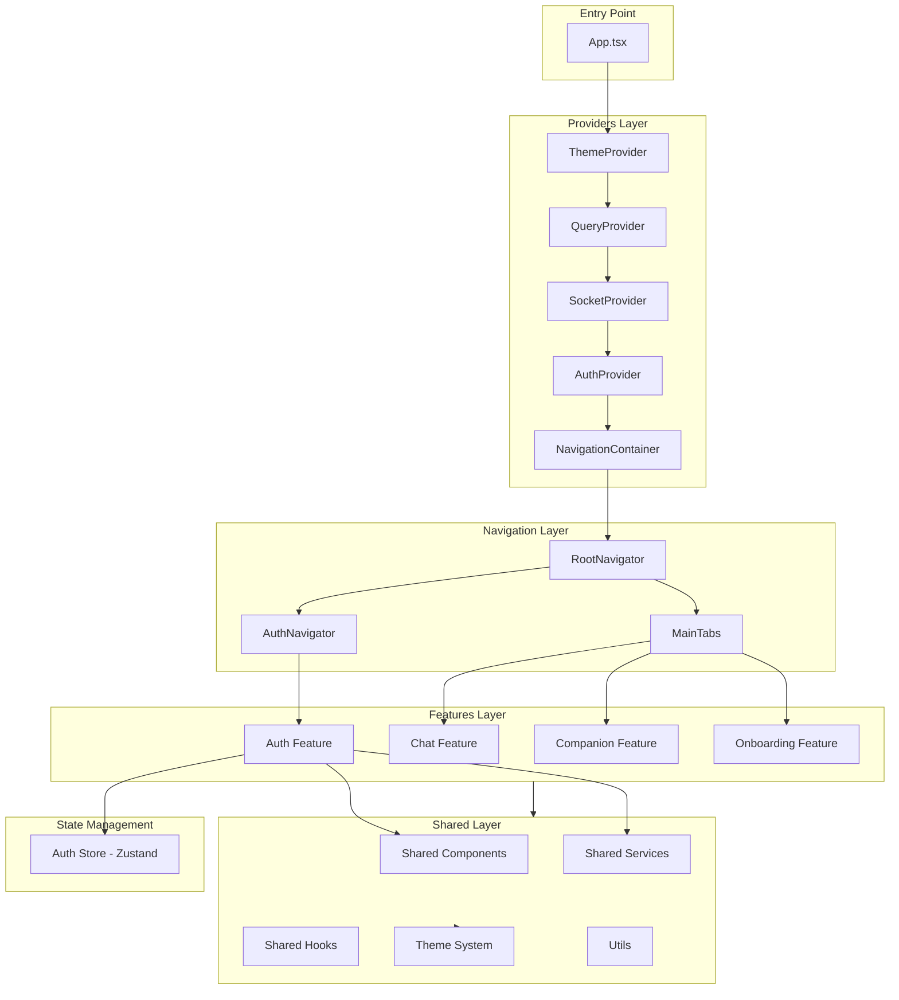
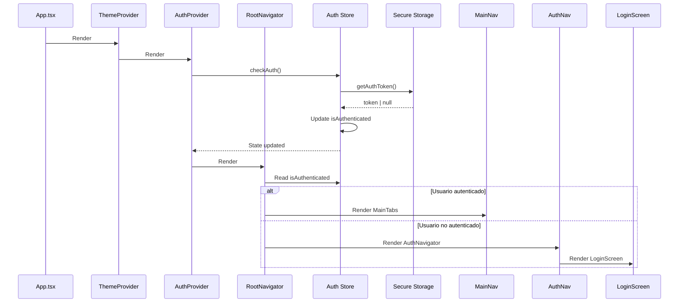
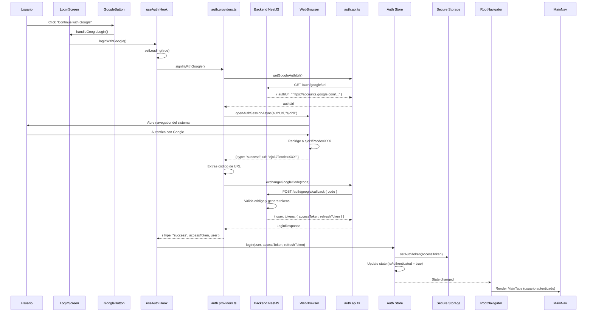
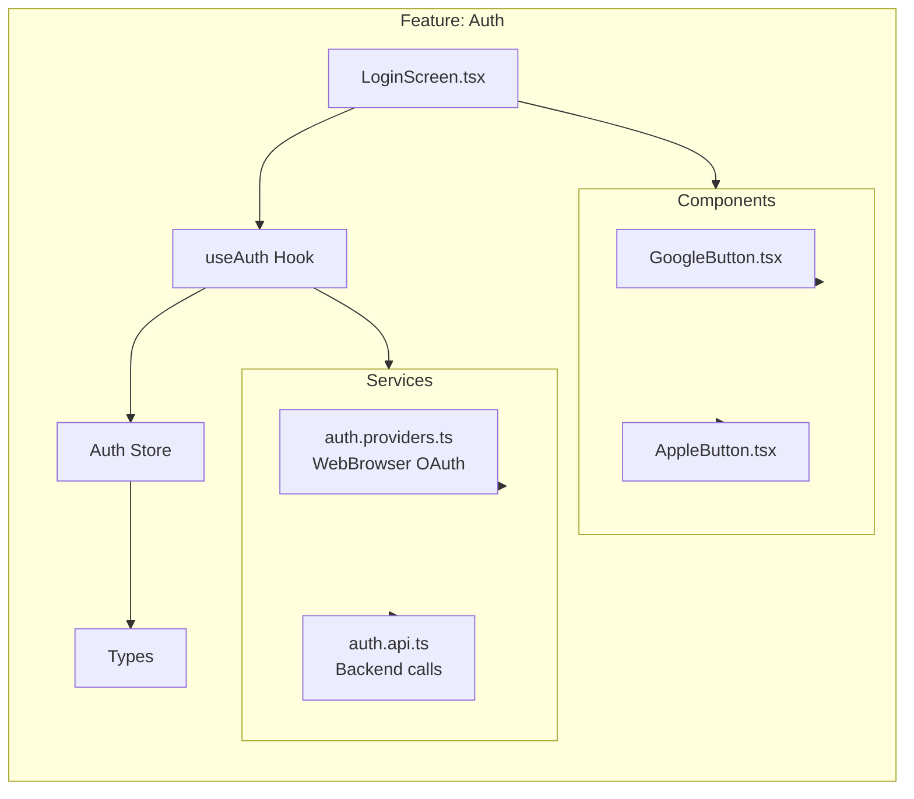
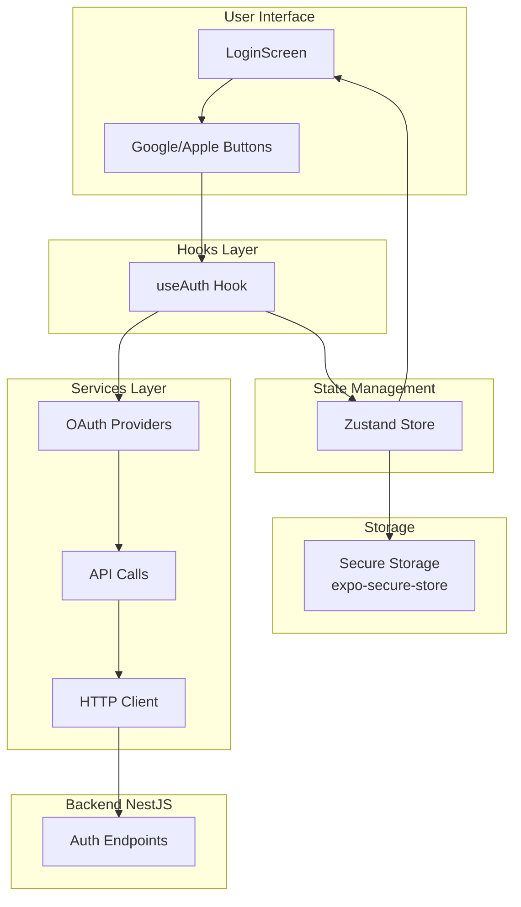
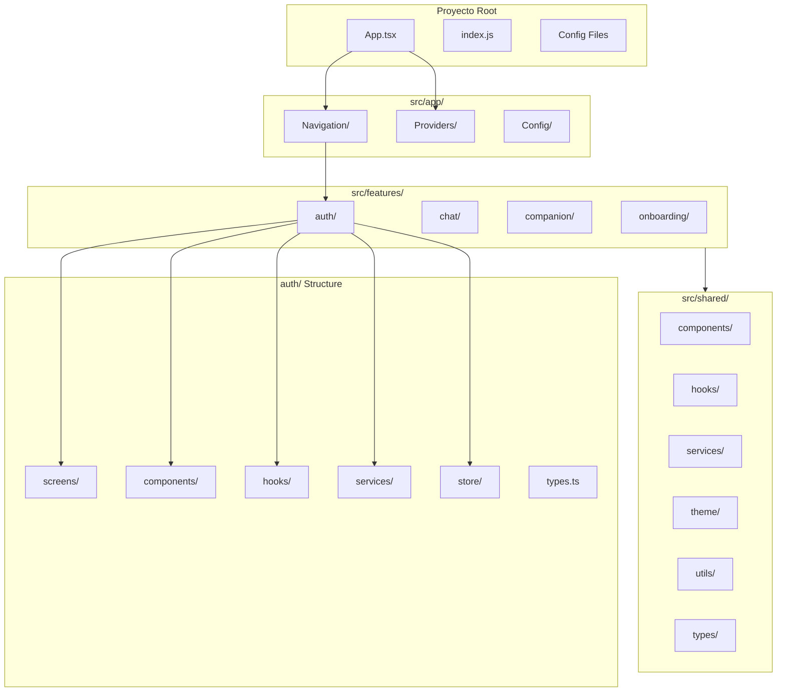
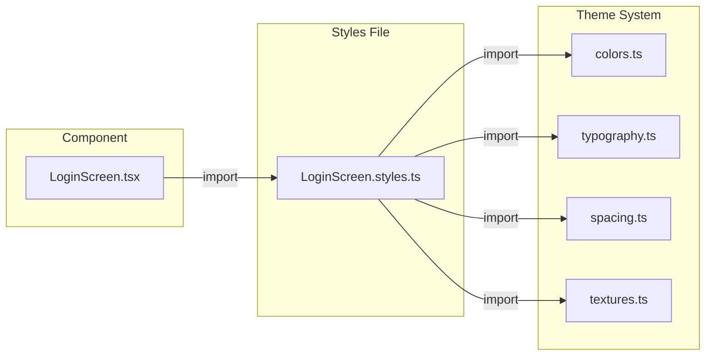
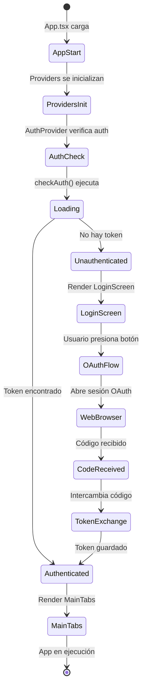

# Arquitectura del Proyecto eJoi Frontend

## Diagrama de Arquitectura General

## Flujo de Inicialización de la App

## Flujo de Autenticación OAuth (Google/Apple)

## Estructura de Features (Auth)

## Flujo de Datos y Estado

## Arquitectura de Carpetas Detallada

## Flujo de Estilos (Segregación)

## Ciclo de Vida de la Aplicación

## Resumen de Tecnologías y Flujos

### Stack Tecnológico
- **UI Framework**: React Native 0.74.0
- **Build Tool**: Expo ~51.0.0
- **Language**: TypeScript 5.3.0
- **Navigation**: React Navigation 6.x
- **State Management**: Zustand 4.5.0
- **OAuth**: expo-web-browser + expo-auth-session
- **Storage**: expo-secure-store (mobile) / localStorage (web)
- **Animations**: react-native-reanimated
- **Styling**: StyleSheet (segregado en archivos .styles.ts)

### Principios de Arquitectura
1. **Modularidad**: Cada feature es independiente
2. **Separación de Responsabilidades**: UI, lógica, servicios separados
3. **Segregación de Estilos**: Todos los estilos en archivos externos
4. **Reutilización**: Componentes y utilidades en `shared/`
5. **Escalabilidad**: Estructura preparada para nuevas features

### Flujos Principales
1. **Inicialización**: App → Providers → Navigation → Features
2. **Autenticación**: Button → Hook → Provider → Backend → Store → Navigation
3. **Estado**: Store (Zustand) → Components → UI Update
4. **Estilos**: Component → Styles File → Theme System

